# Artistic Nueral Transfer 🖌️🎨🧠

## Background

In this repository I will do a PyTorch implementation of the paper [A Neural Algorithm of Artistic Style](https://arxiv.org/abs/1508.06576) by Leon A. Gatys, Alexander S. Ecker, and Matthias Bethge.

By using a deep CNN trained on a large dataset, we can extract **content** features and **style** features in order to produce the desired combination of the two in one image. Here is an example of the Sultan Qaboos Grand Mosque mixed with the style of the Starry Night by Vincent van Gogh.

<div align="center">
    
    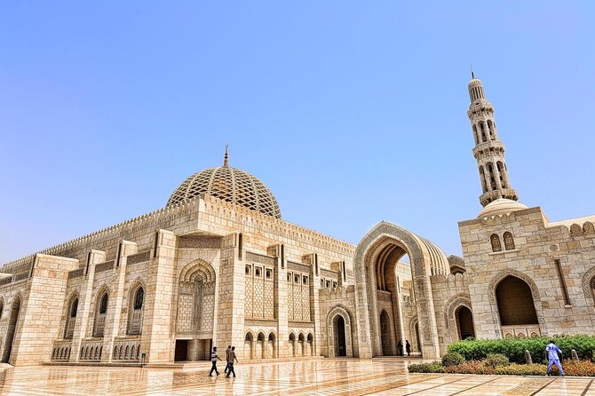
    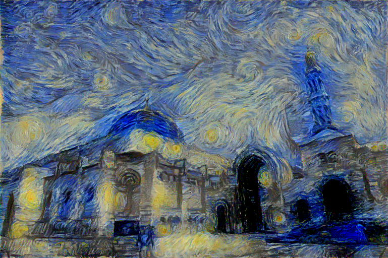
</div>

## Results

Here is a portrait of an apple put with different style images.

<div align="center">
    <div>
        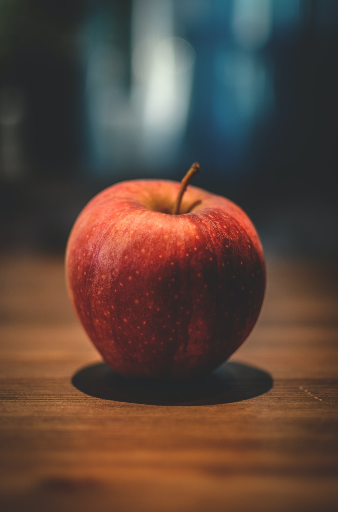
    </div>
    <span>
        
        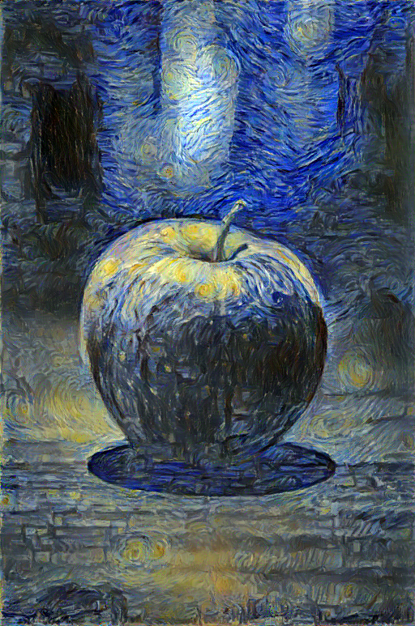
    </span>
    <span>
        
        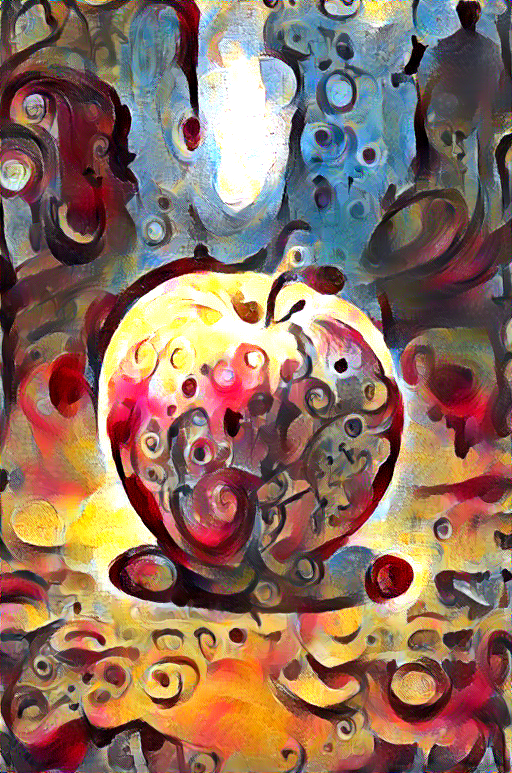
    </span>
    <span>
        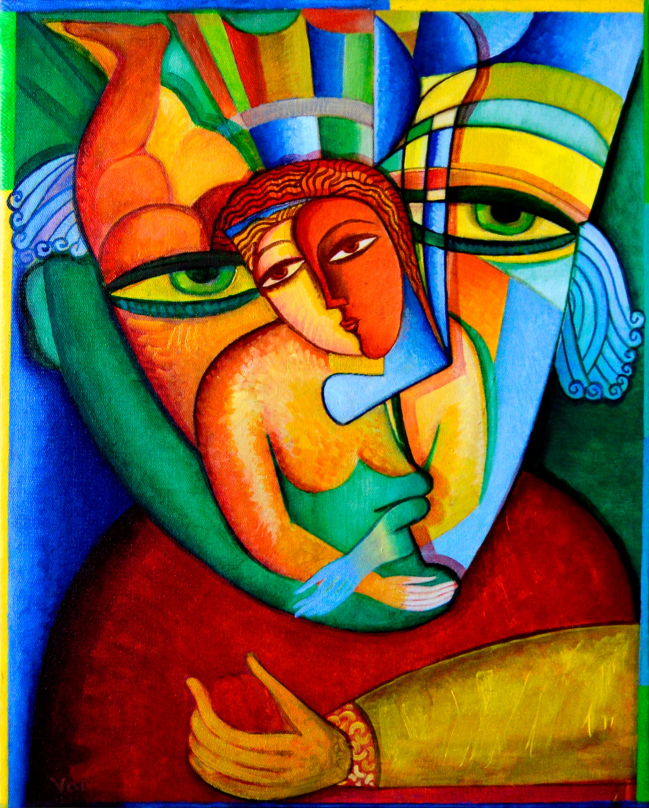
        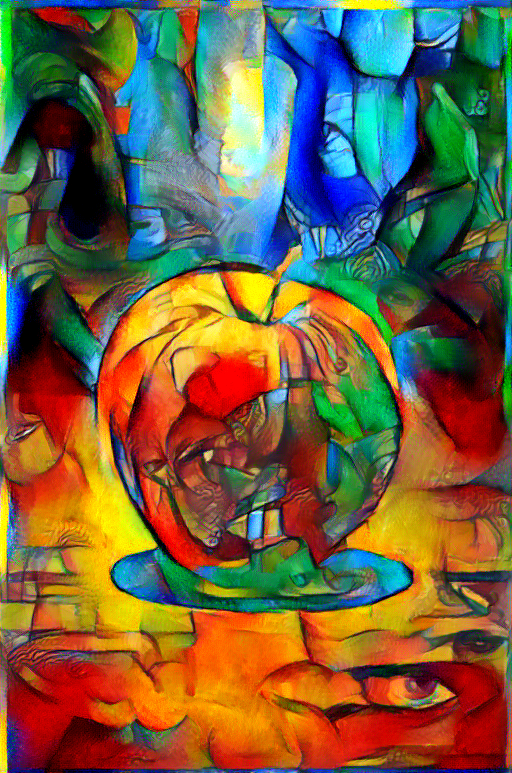
    </span>
    <span>
        
        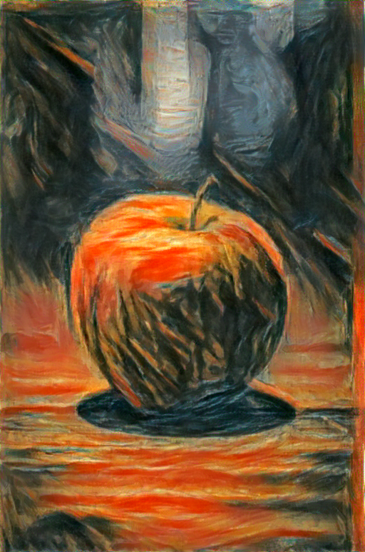
    </span>
</div>

## Control and tradeoffs
There are multiple ways we can manipulate the output given a style and content image, which include:
- Style weight
- Content weight
- TV regularization to improve smoothness

Ideally, I would recommend leaving the content weight at 1 and only changing the style weight, since what matters is their ratio.

By using different weights on the style and content images, we can get different results as shown below where the ratios between the weights of the style image and the content image are 1e4, 1e5, 1e6, 1e7 respectively from left to right.

<div align="center">
    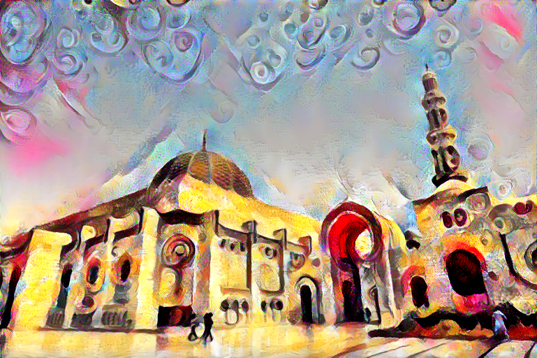
    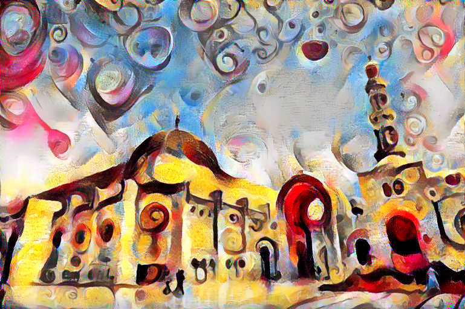
    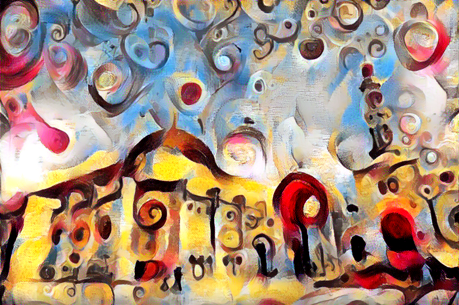
    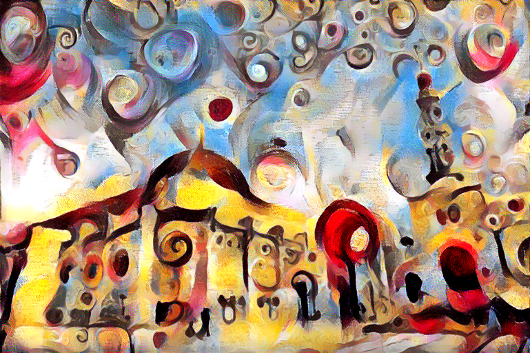
</div>

The effects of TV regularization for when starting from the content image (which is what I recommend) are fairly small from what I've seen, so I won't showcase the differences. A tv weight of 1e-6 to 1e-4 works just fine.
## Installation

You need to first install miniconda. Once you have miniconda installed, all you need to do is download the project file, then navigate the the project file in the terminal, then put the following command.

```
conda env create
```
Now every time you want to use this tool, just type 
```
conda activate artistic-net
```
Now you are ready to use the tool as shown in the following section.
## Usage

Here is an example the simplest way to use this program

```
python artistic_neural_net.py --content-image <PATH TO CONTENT IMAGE> --style-image <PATH TO STYLE IMAGE>
```

The previous command will generate an image and place it in the same directory as the project file, with all the default hyperparamers.

For more customizability, here is a list of all the arguments that can be used.
```
optional arguments:
  -h, --help            show this help message and exit
  --content-image CONTENT_IMAGE
                        path of the content image
  --style-image STYLE_IMAGE
                        path of the style image
  --save-path SAVE_PATH
                        name and path where generated image will be saved
  --image-size IMAGE_SIZE
                        the size of the generated image
  --content-weight CONTENT_WEIGHT
                        style loss weight
  --style-weight STYLE_WEIGHT
                        style loss weight
  --smoothness SMOOTHNESS
                        total variation loss weight to make image smoother
  --init {content,noise}
                        initial image to be used
  --maintain-color      include to maintain the original color of the content image
  --pooling {max,avg}   the pooling used in the network
  --iter ITER           number of optimization steps
  --disp-iter DISP_ITER
                        number of optimization steps before error is displayed
  --content-layers CONTENT_LAYERS [CONTENT_LAYERS ...]
                        specify the content layers, space separated
  --style-layers STYLE_LAYERS [STYLE_LAYERS ...]
                        specify the style layers, space separated
```

## Monitoring stylization

You can also monitor how your image is changing over many iterations, as well as the style, content and total variation losses.

To do this, simply run the following in a different terminal:
```
tensorboard --logdir=runs --samples_per_plugin images={MAX IMAGES}
```
You'll be able to see what your image looks like after each 50 iterations.

Here's how it will look like:

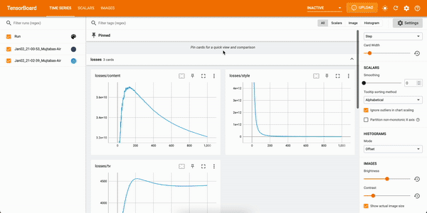

